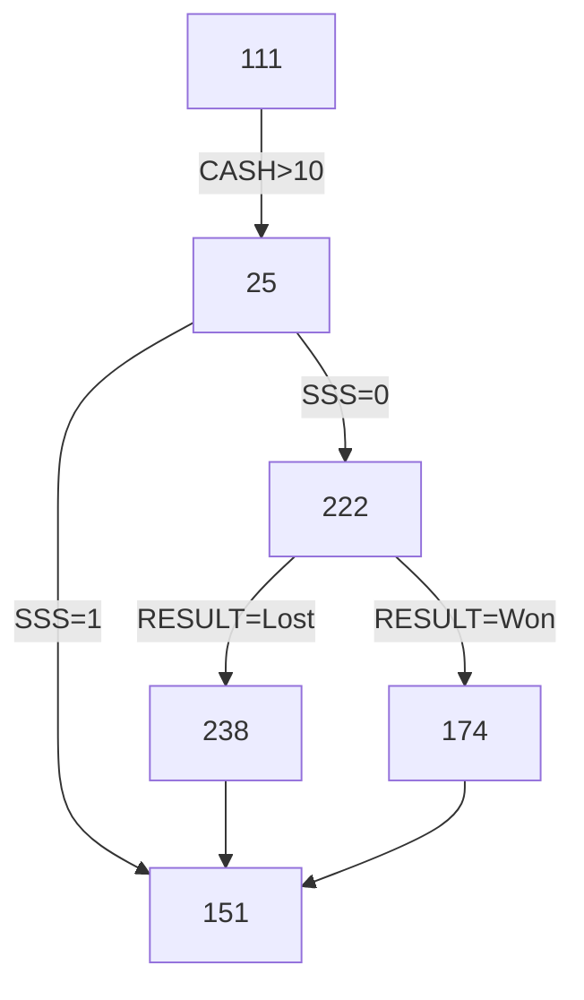

<!--suppress ALL -->

<p align="center">
    <a href="https://www.ninergames.com/" target="_blank">
        
    </a>
</p>

<p align="center">
    
</p>

<hr>

- [Git and GitHub](#git-and-github)
  * [Releases](#releases)
- [Tools](#tools)
  * [Developer Tools](#developer-tools)
  * [Tools for Business Analysis](#tools-for-business-analysis)
  * [Diagrams](#diagrams)
- [Environments](#environments)
  * [Firefox Sync and AnyDesk](#firefox-sync-and-anydesk)
  * [MariaDB Databases](#mariadb-databases)
  * [FTP Accounts](#ftp-accounts)
  * [Subdomain Setup](#subdomain-setup)

# Git and GitHub

Here we discuss topics like git flow, how to work with each new feature, how to make a valid releases etc.

## Releases

All the details are given in [Git Basics - Tagging](https://git-scm.com/book/en/v2/Git-Basics-Tagging) and [Managing releases in a repository](https://docs.github.com/en/repositories/releasing-projects-on-github/managing-releases-in-a-repository).

In short:

1. Make a tag:
    * For exiting commit:
        * List all commits: `git log --pretty=oneline`
        * Pick the one you wish to tag (first seven letters of the has are enough), i.e.: `32c274c`
        * Add a tag: `git tag -a 0.1 32c274c -m "First version before general refactor"`
    * For latest commit: `git tag -a 1.4 -m "My version 1.4"`
    * Please, **do not** use `v1.0` scheme;
        * A version is a version, no need to prepend number with `v`
        * Even if [GitHub claims](https://github.com/akademia-slaska/template-repository/releases/new) that this is a common practice to do so
    * Use [Semantic Versioning 2.0.0](https://semver.org/) (three numbers) whenever possible
2. Push tag(s) to GitHub: `git push --tags`
3. Create [a new release](https://github.com/akademia-slaska/template-repository/releases/new): pick a tag, add title and a description, add some binaries, set options
4. Publish a release or save it as a draft.

GitHub **always adds a source code** to release. We **must always treat** all our releases **purely as private**.

The `git push --tags` pushes tags **only**. Any not-yet-pushed commits must be pushed separately using  `git push`.

# Tools

This chapter gives you an overview on some nifty tools that you can use in development of our projects.

## Developer Tools

To **generate a password** or a key, [RandomKeygen](https://randomkeygen.com/) generator simply rocks!

**Screen sharing**? We can setup a quick 1-to-1 session using jitbit.com free [browser screen sharing tool](https://www.jitbit.com/screensharing/).

For anything related to **Base64 encoding or decoding**, [Base64.Guru](https://base64.guru/) rules! More details [here](https://onezeronull.com/2025/04/10/the-greatness-of-base64-guru/).

For **JavaScript** these two cool tools:

* [ValidateJavaScript](https://validatejavascript.com/): as name says, good and challenging JavaScript linter
* [JSCompress](https://jscompress.com/): strong JavaScript compressor (works on in-line code or uploaded files)

And for **JSON** the [The magic of JSON on-line tools](https://onezeronull.com/?p=3991) article lists some interesting tools.

## Tools for Business Analysis

For **editing Markdown** we have both:

- GitHub (with a great on-line editor and even greater Markdown support) and
- PhpStorm (or any other IDE)

But when a quick on-line editor is needed, you won't probably find anything better than  [StackEdit](https://stackedit.io/app#).

For **converting text files** from one markup format to another, [pandoc](https://pandoc.org/index.html) is your swiss-army knife.

## Diagrams

If diagrams are needed, we can use [MermaidJS tool for JavaScript](https://mermaid.js.org/) across entire GitHub (in issues, wikis, discussions and in regular text files. GitHub support for MermaidJS causes that you can just write something like this:

	```
	flowchart TD
	    111 --> |CASH > 10| 25
	    25 --> |SSS = 1| 151
	    25 --> |SSS = 0| 222
	    222 --> |RESULT = Won| 174
	    222 --> |RESULT = Lost| 238    
	    238 --> 151
	    174 --> 151
	    click 174 href "https://mermaid.live/edit
	```

And you'll end up with something like this:



You can use:

- [Mermaid  Live Editor](https://mermaid.live/) to view rendered MermaidJS code as you type it or
- [mermaid.ink Generator](https://mermaid.ink/) to convert (render) MermaidJS code it into an image or data-uri string.

An alternative to the above *Flow Chart Diagram* is [State Machine Diagram](https://mermaid.live/edit#pako:eNpdjz0LgzAQhv-K3Fh06ejQpV2d3No4HObUQD4kXoQi_vemCdJipofn3gv3btA7SVDDwsj0UDh6NNV6FbaI73Xpiqq6FS0rrbNKmGQcnlXjVmXHbDOf1__s3eMyZZvw-BRKMOQNKhnP2r4BATyRIQF1REkDBs0ChN1jFAO79m17qNkHKiHM8lfkkCQVO9_kpqlwCTPap3MxMqBeaP8ArztTOA). It renders quite similar diagrams.

MermaidJS supports other diagram types. Including: [Class Diagram](https://mermaid.live/edit#pako:eNptkc9OwzAMxl8l8glE-wIVF8SYxGGn3aZKyE28LmrijPzRBGPvTlrWMDZySfyzP-uLfQTpFEED0mAIC429R9uyyOeJtUUjHr_qWiySHG7pUofdLd1Q5_EPbsSD5iiwp2u8jl5zL3piRf4yOUrCCm1-3t1fJSxGmuFke7J3_AGiNO0Ih2dnnC-JcNB2FubwPaEc5vh02W_8WOlXj96D_qRXXhLFgiXyC8Z_9dMIfg11zhmhw9tBG1WgT1y0UIElb1GrvIlJ10LckaUWmvxUtMVkYgstj6WYolt_sIQm-kQVpL3KEznvboakdHR-dV7ueFWwR944l0u2aAKdvgFIMZyC), [Sequence Diagram](https://mermaid.live/edit#pako:eNptkLFqAzEMhl9F0VrfC9yQUujQFDp1K16E_V_OYFuJY1NCyLvXd9ds0fQjfZ9AurFTDx75gnNDdngPciySbKZebzE4DPv9y6fOeaQPxKi0ZEOz_pIU0FXb61N4w5zkBaEZUijhH11mQ0eH1emLw2YbOqzGSndt9xw_0AREOhZI3bHhhJIk-H7FbREs1xkJlscePSZpsVq2-d5RaVW_r9nxWEuD4XbyUh9HP5rwoWr52h6z_sfwSfKPakcmiRfc_wC26mTi) and [Entity Relation Diagram](https://mermaid.live/edit#pako:eNp10VFrgzAQB_CvEu5Z-wF8KxqGMOeIttCRl8ycbUCNpLEw1O--WA1bO5a3HL_7J9yNUGmJEAGaRImzES3viDvxoSjzjDIyT7vdNJKEvqZHyk7hPkkYLQoSkYu4PtlpCkM9kpwl7hKRvhEV_mPSt2OextQpDo0Snw2SWhsOq_7z2lOywQrVzWf7rAVNP6jSNzQbWWu_QZiWNHNKdVUzSB_1zvLkEJdhvC_pS85OvmWr31M7K1T36B_-55M5aCPRoHRvcIAAWjStUNINe1y6OdgLtshhoRJrMTR2GcDsqBisLr66CiJrBgxg6KWwuG3IF1Eqq0227u--xgB60X1o7UgtmivO35Pxk64).

# Environments

Here we discuss everything on accessing these environments, configuration, adding new project, etc.

We are using following environments in the development process:

- DEV server -- your very own piece of gear
- TEST server -- testing each feature on garbage database (`test.domain.com`, [93.179.198.180](http://93.179.198.180/), or [test.as.ftp.sh](http://test.as.ftp.sh/))
- UAT server -- testing on a copy of production database (`uat.domain.com`, [93.179.198.181](http://93.179.198.181/), or [uat.as.ftp.sh](http://uat.as.ftp.sh/))
- PROD server -- `domain.com` (hosted under non-directly accessible `185.253.215.15` IP address)

Accessing these links directly will give you access to some tools only (like phpMyAdmin). Access to this tools is restricted to a limited pool of IP addresses, so you must add your public IP address to that pool in first place (see below). To access TEST or UAT version of your web app use `test.domain.com` or `uat.domain.com` respectively.

External addresses (i.e. [93.179.198.181](http://93.179.198.181/), or [uat.as.ftp.sh](http://uat.as.ftp.sh/), etc.) are not accessible inside Akademia Śląska network.

## Firefox Sync and AnyDesk

We use Firefox Sync as our internal password management. You must install Firefox browser and enable data synchronization to `info@ninergames.com` account. Ask Tomasz to get current password to this account.

Both TEST and UAT servers are running under Windows, within Akademia Śląska network, and with AnyDesk client installed. Most operations can be made remotely, by accessing these servers manually:

- TEST server -- `1452122276`
- UAT server -- `1862316036`

You need to a have physical access to these devices and you must manually add your device's AnyDesk ID to the list of AnyDesk clients allowed to connect. Otherwise you won't be able to access these machines remotely.

## MariaDB Databases

We are using  MariaDB 10.4.32 on TEST and UAT and MariaDB 10.6.21 on PROD.

General rules:

1. Scripts are **not** allowed to access database remotely; you must always use `localhost` as DB's address.
2. New DB users must always be created with _Create database with same name and grant all privileges_ option. And must always be created isolated into single project- and user-related database only.

Username and database name consists of two items in our case:

- Environment name (or `niner` in case of PROD env, as enforced by our hosting) 
- Project's domain name (without protocol and ccTLDs)

Separated by underscore (`_`). Example:

- Hostname:`localhost`
- Database: `dev_ninergames`, `test_ninergames`, `uat_ninergames` or `niner_ninergames`
- Username: `dev_ninergames`, `test_ninergames`, `uat_ninergames` or `niner_ninergames`
- Password: _in Firefox Sync or provided in other way or through other channel_

There is no _master database password_ on any environments that would grant access to everything. If you need to have it, you must access servers physically (via AnyDesk or DirectAdmin) and the whole work this way.

## FTP Accounts

General rules:

1. Any FTP client (i.e. one in Total Commander) must be used, as there is no browser- or web-access via FTP.
2. There is no FTP access to DEV environment as files are accessed directly.
3. FTP access to TEST and UAT is limited to backup locations only.

Example:

- TEST environment: `93.179.198.180` (external) or `10.0.2.34` (internal) host and `ftp@ninergames.com` user
- PROD environment: `test.ninergames.com`, `uat.ninergames.com` or `ninergames.com`
- PROD environment: `test.ninergames.com`, `uat.ninergames.com` or `ninergames.com`
- PROD environment: `185.253.215.15` host and `ftp@ninergames.com` user
- Username: `ftp@test.ninergames.com`, `ftp@uat.ninergames.com` or 
- Password: _in Firefox Sync or provided in other way or through other channel_

For PROD environment FTP access is provided as a secondary solution for directly solving some really nasty problems only. Regular source code update **must be carried out via `git pull` or `git fetch` commands only**.

## Subdomain Setup

For every domain that we own we can setup a `test.domain.com` and`uat.domain.com` subdomains to access our TEST or UAT environments easily. This can be done by Tomasz only. No one else has access to domain configuration.

Visit [DNS section](  
https://web5.aftermarket.hosting:2222/evo/user/dns) in DirectAdmin for WEB5 cluster at AfterMarket Hosting and add a new set of **A records**:

- `test` → `93.179.198.180`
- `www.test` → `93.179.198.180`
- `uat` → `93.179.198.181`
- `www.uat` → `93.179.198.181`

Value set for TTL doesn't actually matter. You can set TTL to `3600`, `28800` or `86400` .

Allow up to 24-36 hours before the above made changes are propagated across entire world (all DNSes).